# Practica07_240687
Este proyecto es una web que aplica las 4 operaciones básicas a una base de datos, Creación (Create), Lectura (Read), Actualización (Update) y Eliminación (Delete) de registros a una tabla, utilizando HTML, CSS y JS para FrontEnd , PHP y MySQL cómo backend.

# Capturas
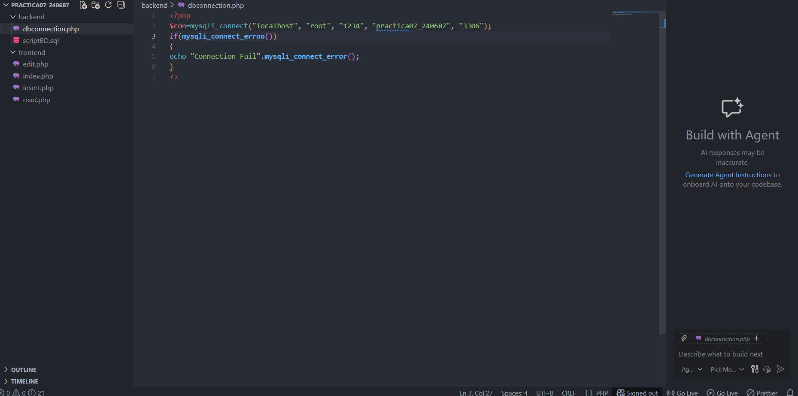
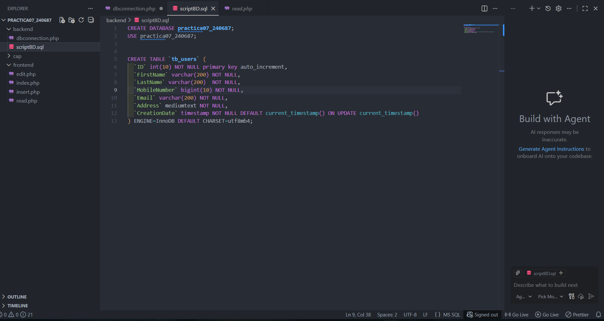
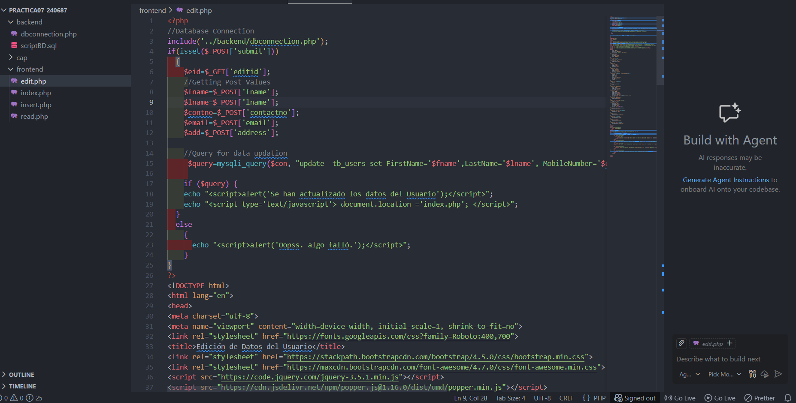
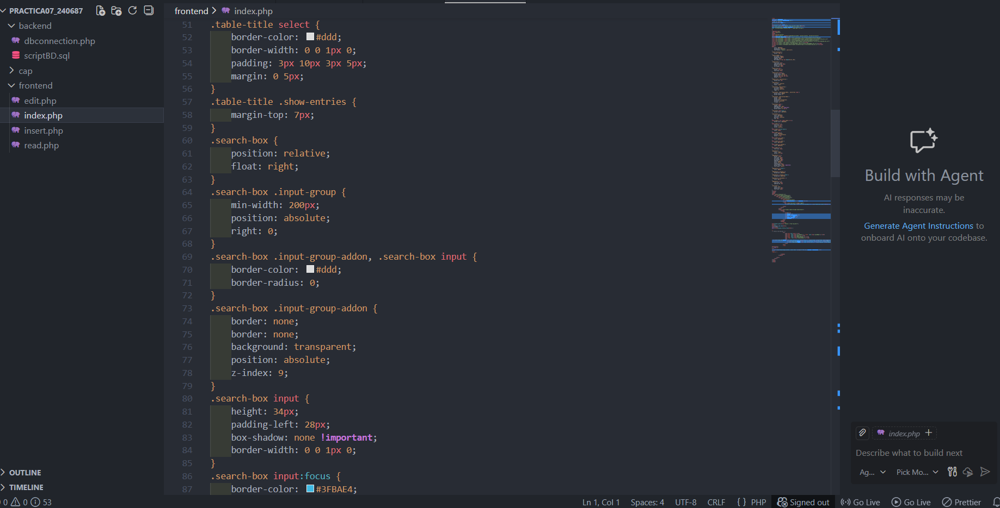
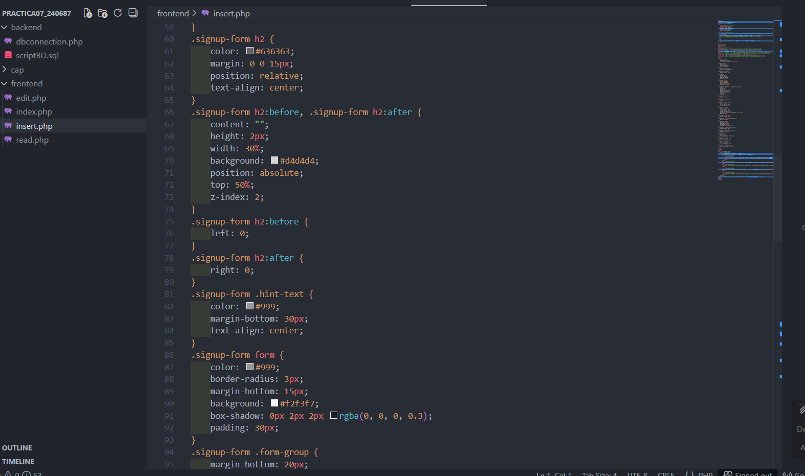
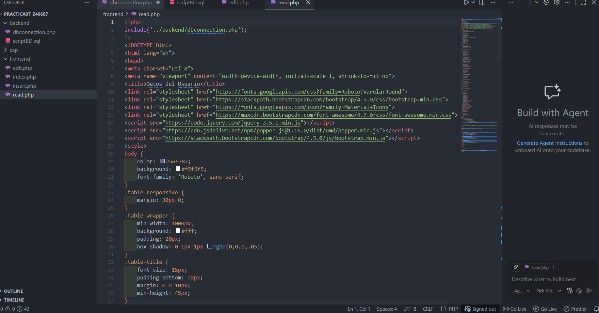
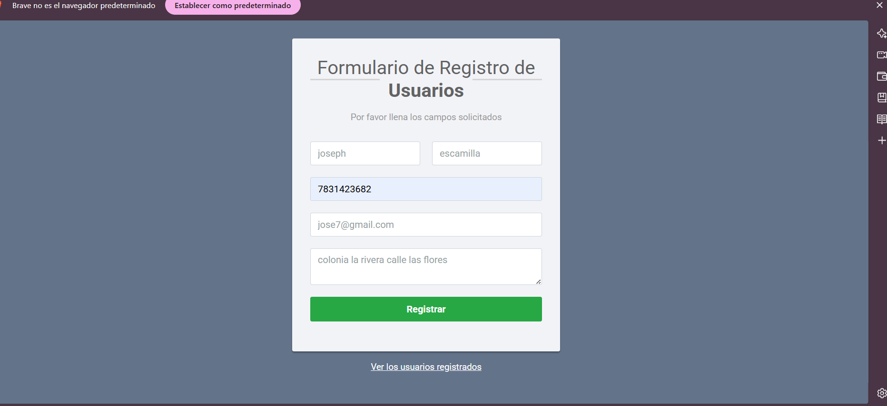
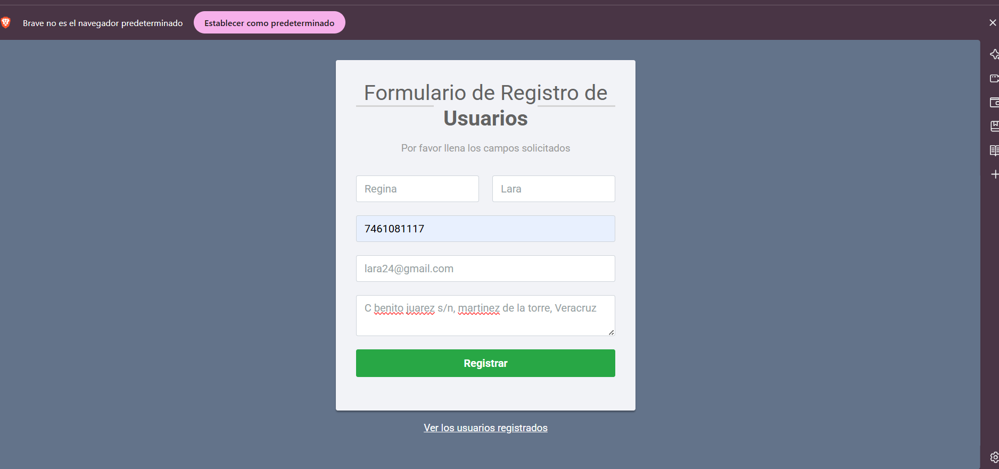
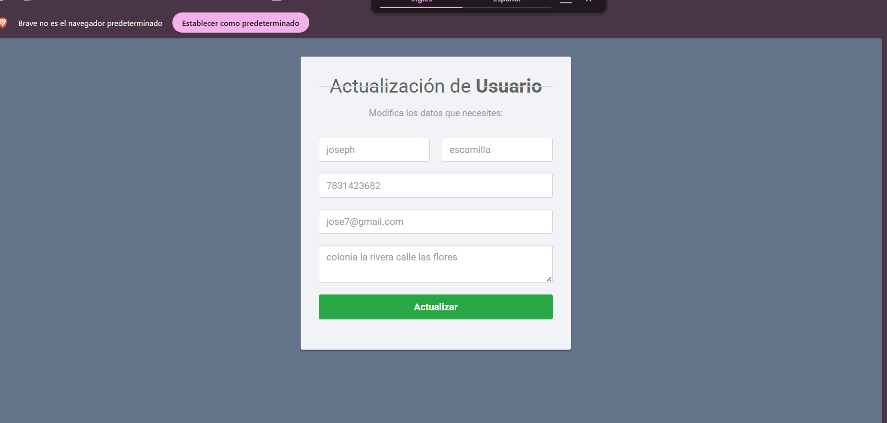
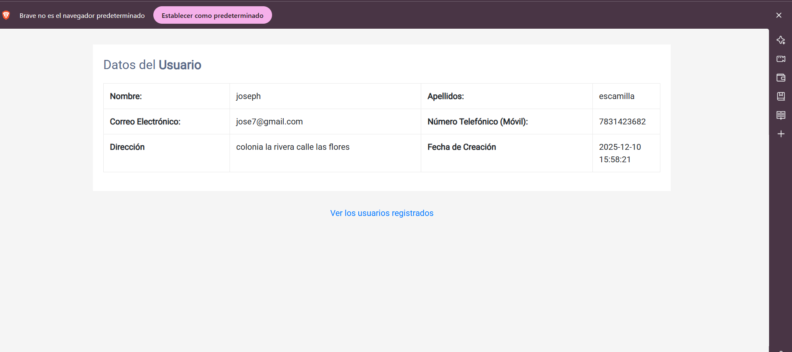
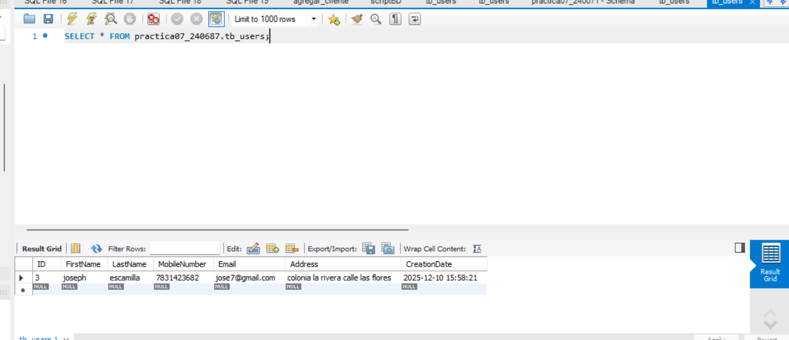
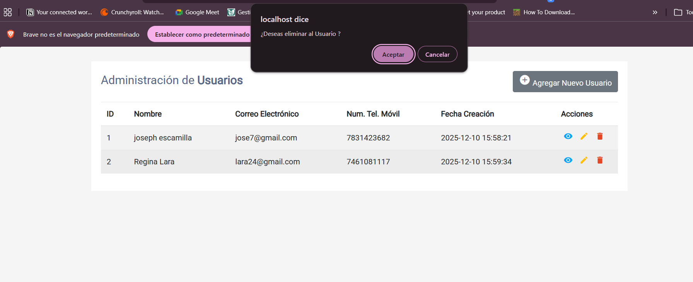
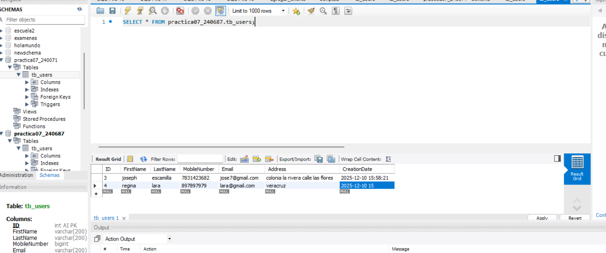
